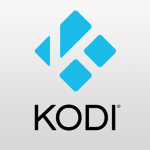
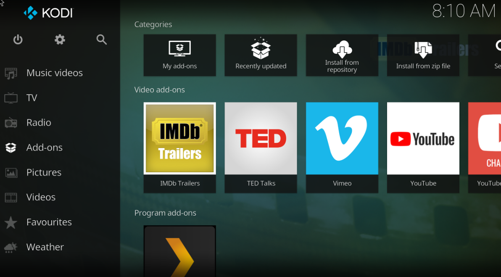

   
  <b>Kodi UWP for Windows ARM</b> 
  <a href="./src">Source</a> |
  <a href="https://github.com/xbmc/xbmc">Original Project</a> 
    
    

# Target

- Windows ARM
- Min build 15035

# Credits
- Kodi Team (Original & main developers)
- Bashar Astifan (UWP ARM Optimizations)

