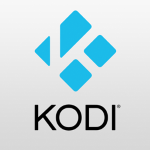

   
  <b>Kodi UWP for Windows ARM32</b> 
  <a href="./src">Source</a> |
  <a href="https://github.com/xbmc/xbmc">Original Project</a> 
    
    

# Target

- Windows ARM32
- Min build 15035

## ARM64 or Latest
- This repo for ARM32, legacy support only
- Refer to the official repo for any updates ([Click here](https://kodi.tv/download/))
- Please don't ask or contact me for other than ARM32
- This repo is not meant to be up-to date fork (nor redistribution)

# UWP improvements
This app supported by [UWP2Win32](https://github.com/basharast/UWP2Win32)

# Addons update
I disabled addons updates by default
to get the latest updates enable that from:
- `Kodi->Settings->System`
- At `Updates` Choose `Notify` or `Install`

# Helpful links

[Kodi Wiki](https://kodi.wiki/view/Main_Page)

# Build

Please check the source page (src) for build instructions

# Credits
- Kodi Team (Original & main developers)
- Bashar Astifan (UWP ARM improvements)
- [Gustave Monce](https://github.com/gus33000) (DLL dynamic loading solution)

